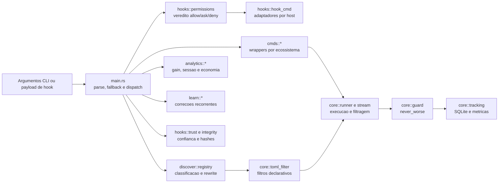

# C4 - Componentes Internos

| Componente | Responsabilidade | Dependencias principais |
|---|---|---|
| `main` | Entrada, flags, fallback e dispatch. | todos os modulos top-level. |
| `discover::registry` | Decide se e como um comando pode virar `rtk ...`. | lexer, regras e configuracao de hooks. |
| `hooks::permissions` / `hook_cmd` | Preserva permissoes do host e adapta protocolos de hook. | regras de host, JSON, registry. |
| `cmds::*` | Filtros especializados por ferramenta/ecossistema. | runner, parsers e utilitarios. |
| `core::runner` / `stream` / `guard` | Execucao, captura, filtragem, tee, exit code e guard de tamanho. | processos filhos e tracking. |
| `core::tracking` | Schema SQLite, retencao e agregacoes. | `rusqlite`, configuracao. |
| `analytics::*` / `learn::*` | Relatorios, descoberta de uso e regras extraidas. | tracking e historicos dos hosts. |
| `hooks::trust` / `integrity` | Trust por hash e verificacao de hooks. | SHA-256, filesystem e config. |

🟢 O `runner` e a rota compartilhada dominante para wrappers; 🟡 a dependencia de `core` em `hooks` merece refatoracao ou uma fronteira documentada.
