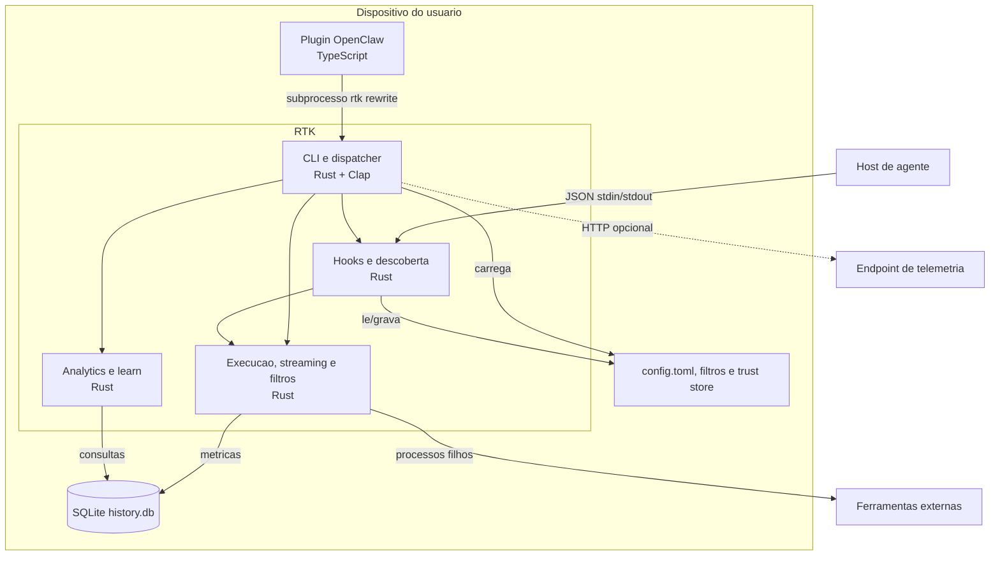

# C4 - Containers

| Container | Tecnologias | Comunicacao | Confianca |
|---|---|---|---|
| CLI e dispatcher | Rust, Clap | chamadas de modulo e processos filhos | 🟢 |
| Motor de execucao | Rust, `std::process`, parsers/TOML | stdout/stderr, streaming e tracking | 🟢 |
| Hooks e descoberta | Rust, JSON, SHA-256 | stdin/stdout, arquivos de settings e regras | 🟢 |
| Analytics e learn | Rust, SQLite | queries e historicos locais | 🟢 |
| SQLite | `rusqlite` bundled | arquivo local, WAL/busy timeout tentados | 🟢 |
| Plugin OpenClaw | TypeScript | API OpenClaw e subprocesso | 🟢 |

🟡 O limite entre `core` e `hooks` e permeavel por chamadas diretas de `core` para `hooks`; isso indica acoplamento transversal, nao um container adicional.
