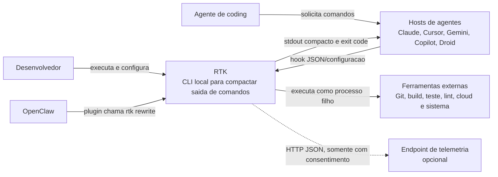

# C4 - Contexto do Sistema

## Diagrama

## Relacionamentos

| Origem | Destino | Relacao | Confianca |
|---|---|---|---|
| Desenvolvedor | RTK | Opera CLI, instala hooks e administra configuracao/trust. | 🟢 |
| Hosts de agentes | RTK | Executam handlers ou permitem rewrite de comando. | 🟢 |
| RTK | Ferramentas externas | Executa e comprime output sem substituir a ferramenta. | 🟢 |
| OpenClaw | RTK | Plugin intercepta `exec` e invoca `rtk rewrite`. | 🟢 |
| RTK | Endpoint de telemetria | Envia ping opcional e assincrono. | 🟢 |

🔴 A compatibilidade concreta depende das versoes externas de cada host e ferramenta.
