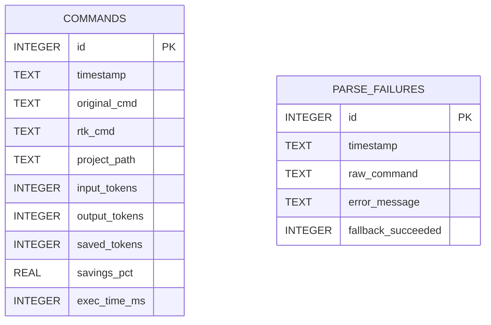

# ERD Completo - Tracking Local

## Escopo

🟢 **CONFIRMADO** - o schema persistido implementado por RTK e local, em SQLite. Nao foram encontradas chaves estrangeiras nem relacionamentos obrigatorios entre as duas tabelas.

## Tabelas e indices

| Tabela | Finalidade | PK | Indices | Retencao |
|---|---|---|---|---|
| `commands` | Execucao, saida bruta/filtrada estimada e tempo por projeto. | `id` | `idx_timestamp`; `idx_project_path_timestamp` | limpeza apos gravacao, padrao de 90 dias. |
| `parse_failures` | Falhas de parsing e sucesso do fallback. | `id` | `idx_pf_timestamp` | limpeza no mesmo ciclo de `commands`. |

## Regras de dados

- 🟢 `saved_tokens` usa subtracao saturada de `input_tokens - output_tokens`.
- 🟢 `savings_pct` e zero quando `input_tokens` e zero.
- 🟢 `project_path` e o caminho canonico do CWD quando resolvivel; caso contrario, string vazia.
- 🟢 As migracoes `exec_time_ms` e `project_path` usam `ALTER TABLE` tolerante a erro para bases existentes.
- 🟡 `parse_failures.raw_command` pode se referir logicamente a um comando em `commands`, mas nao ha FK e nem garantia de correspondencia um-para-um.

## Lacunas

- 🔴 O caminho de arquivo aparece como `history.db` no codigo e `tracking.db` em partes da documentacao, exigindo reconciliacao.
- 🔴 O comportamento de WAL e `busy_timeout` sob multiplas instancias nao foi executado.
