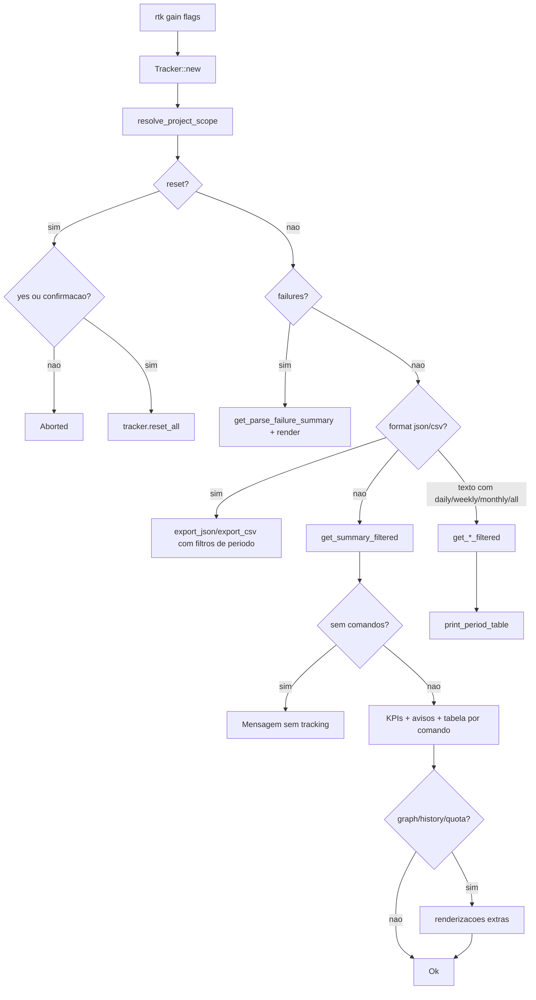
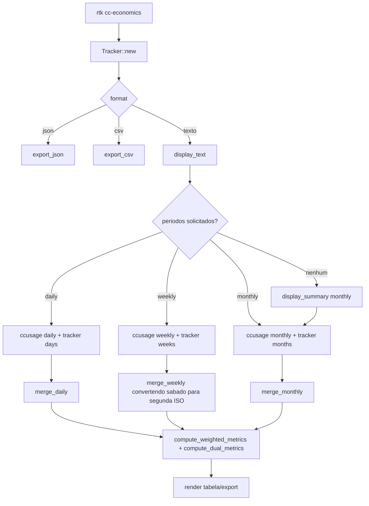
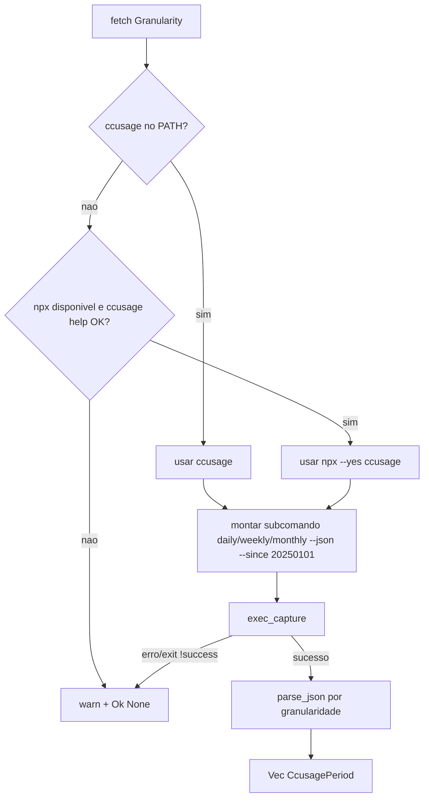
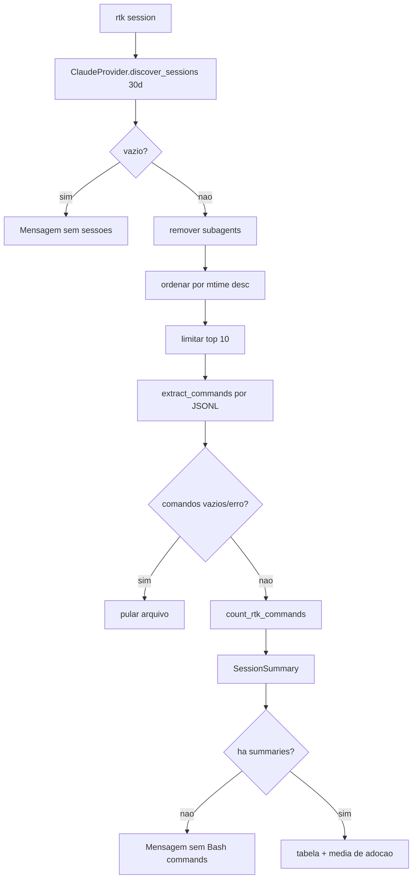

# Fluxograma — Modulo `analytics`

## `rtk gain`

```mermaid
flowchart TD
    A[rtk gain flags] --> B[Tracker::new]
    B --> C[resolve_project_scope]
    C --> D{reset?}
    D -- sim --> E{yes ou confirmacao?}
    E -- nao --> F[Aborted]
    E -- sim --> G[tracker.reset_all]
    D -- nao --> H{failures?}
    H -- sim --> I[get_parse_failure_summary + render]
    H -- nao --> J{format json/csv?}
    J -- sim --> K[export_json/export_csv com filtros de periodo]
    J -- nao --> L[get_summary_filtered]
    L --> M{sem comandos?}
    M -- sim --> N[Mensagem sem tracking]
    M -- nao --> O[KPIs + avisos + tabela por comando]
    O --> P{graph/history/quota?}
    P -- sim --> Q[renderizacoes extras]
    P -- nao --> R[Ok]
    Q --> R
    J -- texto com daily/weekly/monthly/all --> S[get_*_filtered]
    S --> T[print_period_table]
```

## `rtk cc-economics`

```mermaid
flowchart TD
    A[rtk cc-economics] --> B[Tracker::new]
    B --> C{format}
    C -- json --> D[export_json]
    C -- csv --> E[export_csv]
    C -- texto --> F[display_text]
    F --> G{periodos solicitados?}
    G -- nenhum --> H[display_summary monthly]
    G -- daily --> I[ccusage daily + tracker days]
    G -- weekly --> J[ccusage weekly + tracker weeks]
    G -- monthly --> K[ccusage monthly + tracker months]
    H --> K
    I --> L[merge_daily]
    J --> M[merge_weekly convertendo sabado para segunda ISO]
    K --> N[merge_monthly]
    L --> O[compute_weighted_metrics + compute_dual_metrics]
    M --> O
    N --> O
    O --> P[render tabela/export]
```

## `ccusage::fetch`

```mermaid
flowchart TD
    A[fetch Granularity] --> B{ccusage no PATH?}
    B -- sim --> C[usar ccusage]
    B -- nao --> D{npx disponivel e ccusage help OK?}
    D -- sim --> E[usar npx --yes ccusage]
    D -- nao --> F[warn + Ok None]
    C --> G[montar subcomando daily/weekly/monthly --json --since 20250101]
    E --> G
    G --> H[exec_capture]
    H -- erro/exit !success --> F
    H -- sucesso --> I[parse_json por granularidade]
    I --> J[Vec CcusagePeriod]
```

## `rtk session`

```mermaid
flowchart TD
    A[rtk session] --> B[ClaudeProvider.discover_sessions 30d]
    B --> C{vazio?}
    C -- sim --> D[Mensagem sem sessoes]
    C -- nao --> E[remover subagents]
    E --> F[ordenar por mtime desc]
    F --> G[limitar top 10]
    G --> H[extract_commands por JSONL]
    H --> I{comandos vazios/erro?}
    I -- sim --> J[pular arquivo]
    I -- nao --> K[count_rtk_commands]
    K --> L[SessionSummary]
    L --> M{ha summaries?}
    M -- nao --> N[Mensagem sem Bash commands]
    M -- sim --> O[tabela + media de adocao]
```
