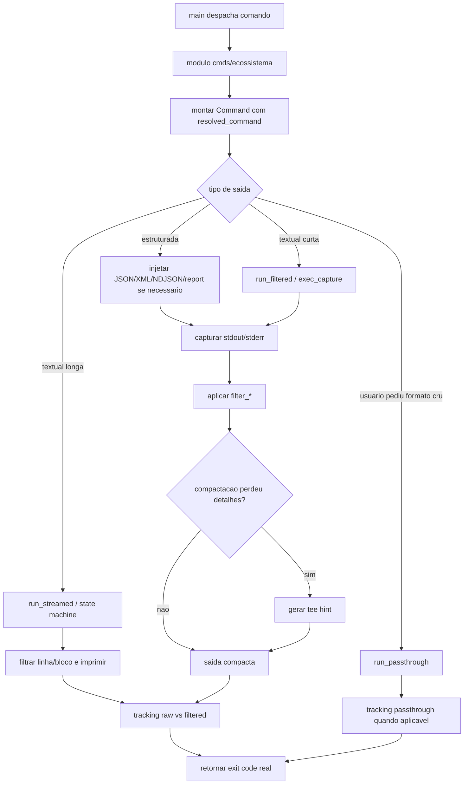
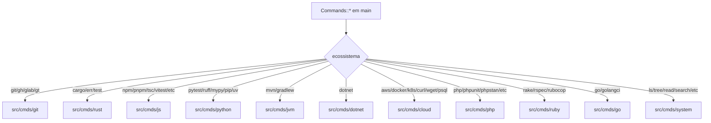
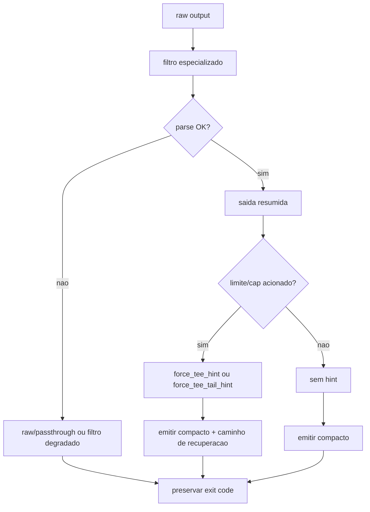

# Fluxograma — Modulo `cmds`

## Padrao de execucao filtrada

```mermaid
flowchart TD
    A[main despacha comando] --> B[modulo cmds/ecossistema]
    B --> C[montar Command com resolved_command]
    C --> D{tipo de saida}
    D -- estruturada --> E[injetar JSON/XML/NDJSON/report se necessario]
    D -- textual curta --> F[run_filtered / exec_capture]
    D -- textual longa --> G[run_streamed / state machine]
    D -- usuario pediu formato cru --> H[run_passthrough]
    E --> I[capturar stdout/stderr]
    F --> I
    G --> J[filtrar linha/bloco e imprimir]
    I --> K[aplicar filter_*]
    K --> L{compactacao perdeu detalhes?}
    L -- sim --> M[gerar tee hint]
    L -- nao --> N[saida compacta]
    M --> N
    J --> O[tracking raw vs filtered]
    N --> O
    H --> P[tracking passthrough quando aplicavel]
    O --> Q[retornar exit code real]
    P --> Q
```

## Escolha de filtro por ecossistema

```mermaid
flowchart TD
    A[Commands::* em main] --> B{ecossistema}
    B -- git/gh/glab/gt --> C[src/cmds/git]
    B -- cargo/err/test --> D[src/cmds/rust]
    B -- npm/pnpm/tsc/vitest/etc --> E[src/cmds/js]
    B -- pytest/ruff/mypy/pip/uv --> F[src/cmds/python]
    B -- mvn/gradlew --> G[src/cmds/jvm]
    B -- dotnet --> H[src/cmds/dotnet]
    B -- aws/docker/k8s/curl/wget/psql --> I[src/cmds/cloud]
    B -- php/phpunit/phpstan/etc --> J[src/cmds/php]
    B -- rake/rspec/rubocop --> K[src/cmds/ruby]
    B -- go/golangci --> L[src/cmds/go]
    B -- ls/tree/read/search/etc --> M[src/cmds/system]
```

## Fallback e recuperabilidade

```mermaid
flowchart TD
    A[raw output] --> B[filtro especializado]
    B --> C{parse OK?}
    C -- nao --> D[raw/passthrough ou filtro degradado]
    C -- sim --> E[saida resumida]
    E --> F{limite/cap acionado?}
    F -- sim --> G[force_tee_hint ou force_tee_tail_hint]
    F -- nao --> H[sem hint]
    G --> I[emitir compacto + caminho de recuperacao]
    H --> J[emitir compacto]
    D --> K[preservar exit code]
    I --> K
    J --> K
```
