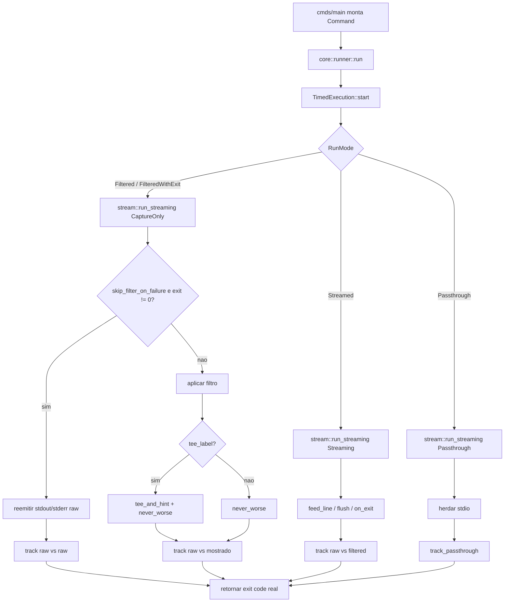
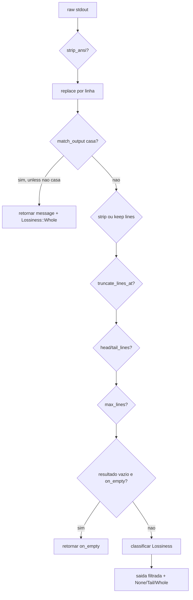
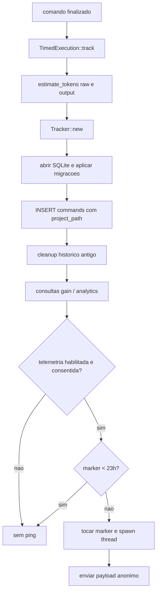

# Fluxograma — Modulo `core`

## Execucao compartilhada de comandos

```mermaid
flowchart TD
    A[cmds/main monta Command] --> B[core::runner::run]
    B --> C[TimedExecution::start]
    C --> D{RunMode}
    D -- Filtered / FilteredWithExit --> E[stream::run_streaming CaptureOnly]
    D -- Streamed --> F[stream::run_streaming Streaming]
    D -- Passthrough --> G[stream::run_streaming Passthrough]
    E --> H{skip_filter_on_failure e exit != 0?}
    H -- sim --> I[reemitir stdout/stderr raw]
    H -- nao --> J[aplicar filtro]
    J --> K{tee_label?}
    K -- sim --> L[tee_and_hint + never_worse]
    K -- nao --> M[never_worse]
    F --> N[feed_line / flush / on_exit]
    G --> O[herdar stdio]
    I --> P[track raw vs raw]
    L --> Q[track raw vs mostrado]
    M --> Q
    N --> R[track raw vs filtered]
    O --> S[track_passthrough]
    P --> T[retornar exit code real]
    Q --> T
    R --> T
    S --> T
```

## Pipeline TOML

```mermaid
flowchart TD
    A[raw stdout] --> B{strip_ansi?}
    B --> C[replace por linha]
    C --> D{match_output casa?}
    D -- sim, unless nao casa --> E[retornar message + Lossiness::Whole]
    D -- nao --> F{strip ou keep lines}
    F --> G{truncate_lines_at?}
    G --> H{head/tail_lines?}
    H --> I{max_lines?}
    I --> J{resultado vazio e on_empty?}
    J -- sim --> K[retornar on_empty]
    J -- nao --> L[classificar Lossiness]
    L --> M[saida filtrada + None/Tail/Whole]
```

## Tracking e telemetria

```mermaid
flowchart TD
    A[comando finalizado] --> B[TimedExecution::track]
    B --> C[estimate_tokens raw e output]
    C --> D[Tracker::new]
    D --> E[abrir SQLite e aplicar migracoes]
    E --> F[INSERT commands com project_path]
    F --> G[cleanup historico antigo]
    G --> H[consultas gain / analytics]
    H --> I{telemetria habilitada e consentida?}
    I -- nao --> J[sem ping]
    I -- sim --> K{marker < 23h?}
    K -- sim --> J
    K -- nao --> L[tocar marker e spawn thread]
    L --> M[enviar payload anonimo]
```

