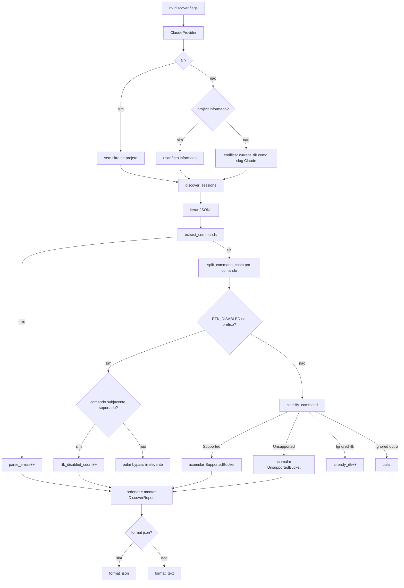
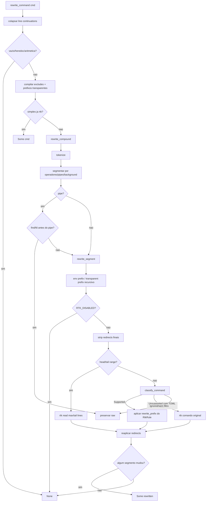
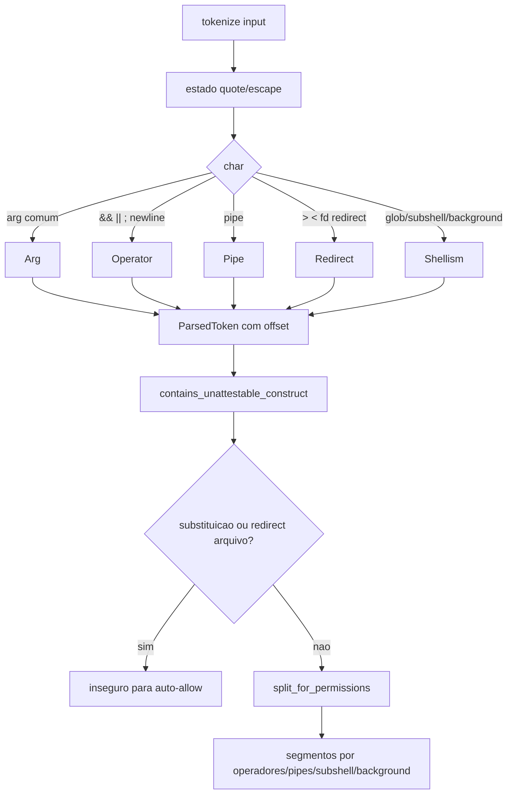

# Fluxograma — Modulo `discover`

## `rtk discover`

```mermaid
flowchart TD
    A[rtk discover flags] --> B[ClaudeProvider]
    B --> C{all?}
    C -- sim --> D[sem filtro de projeto]
    C -- nao --> E{project informado?}
    E -- sim --> F[usar filtro informado]
    E -- nao --> G[codificar current_dir como slug Claude]
    D --> H[discover_sessions]
    F --> H
    G --> H
    H --> I[iterar JSONL]
    I --> J[extract_commands]
    J -- erro --> K[parse_errors++]
    J -- ok --> L[split_command_chain por comando]
    L --> M{RTK_DISABLED no prefixo?}
    M -- sim --> N{comando subjacente suportado?}
    N -- sim --> O[rtk_disabled_count++]
    N -- nao --> P[pular bypass irrelevante]
    M -- nao --> Q[classify_command]
    Q -- Supported --> R[acumular SupportedBucket]
    Q -- Unsupported --> S[acumular UnsupportedBucket]
    Q -- Ignored rtk --> T[already_rtk++]
    Q -- Ignored outro --> U[pular]
    R --> V[ordenar e montar DiscoverReport]
    S --> V
    O --> V
    K --> V
    V --> W{format json?}
    W -- sim --> X[format_json]
    W -- nao --> Y[format_text]
```

## Rewrite Ao Vivo

```mermaid
flowchart TD
    A[rewrite_command cmd] --> B[colapsar line continuations]
    B --> C{vazio/heredoc/aritmetica?}
    C -- sim --> D[None]
    C -- nao --> E[compilar excludes + prefixos transparentes]
    E --> F{simples ja rtk?}
    F -- sim --> G[Some cmd]
    F -- nao --> H[rewrite_compound]
    H --> I[tokenize]
    I --> J[segmentar por operadores/pipes/background]
    J --> K{pipe?}
    K -- sim --> L{find/fd antes do pipe?}
    L -- sim --> M[preservar raw]
    L -- nao --> N[rewrite_segment]
    K -- nao --> N
    N --> O[env prefix / transparent prefix recursivo]
    O --> P{RTK_DISABLED?}
    P -- sim --> D
    P -- nao --> Q[strip redirects finais]
    Q --> R{head/tail range?}
    R -- sim --> S[rtk read max/tail lines]
    R -- nao --> T[classify_command]
    T -- Supported --> U[aplicar rewrite_prefix do RtkRule]
    T -- Unsupported com TOML filter --> V[rtk comando original]
    T -- Ignored/sem filtro --> M
    S --> W[reaplicar redirects]
    U --> W
    V --> W
    W --> X{algum segmento mudou?}
    X -- sim --> Y[Some rewritten]
    X -- nao --> D
```

## Lexer e Permissoes

```mermaid
flowchart TD
    A[tokenize input] --> B[estado quote/escape]
    B --> C{char}
    C -- arg comum --> D[Arg]
    C -- && || ; newline --> E[Operator]
    C -- pipe --> F[Pipe]
    C -- > < fd redirect --> G[Redirect]
    C -- glob/subshell/background --> H[Shellism]
    D --> I[ParsedToken com offset]
    E --> I
    F --> I
    G --> I
    H --> I
    I --> J[contains_unattestable_construct]
    J --> K{substituicao ou redirect arquivo?}
    K -- sim --> L[inseguro para auto-allow]
    K -- nao --> M[split_for_permissions]
    M --> N[segmentos por operadores/pipes/subshell/background]
```
