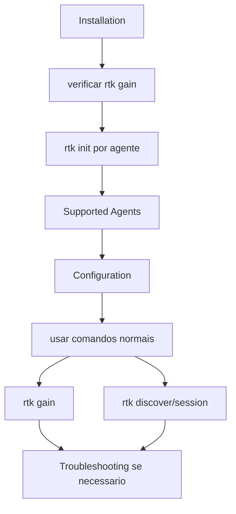
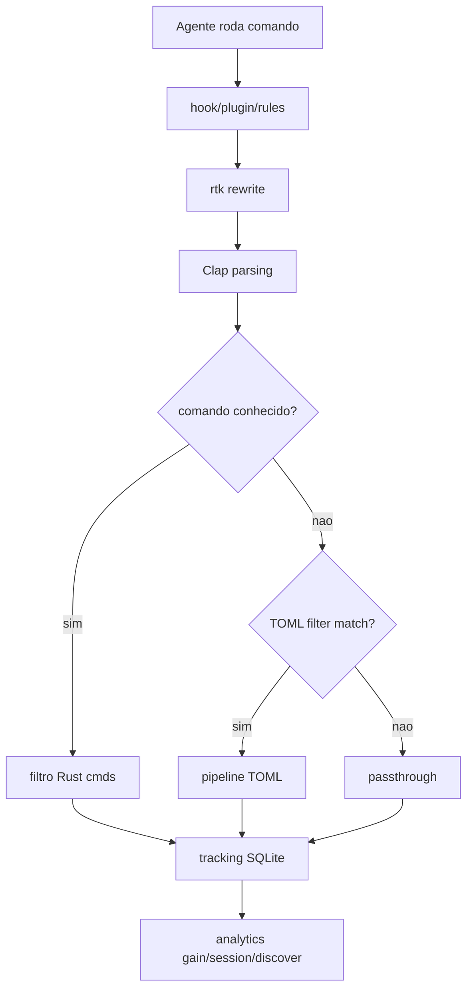
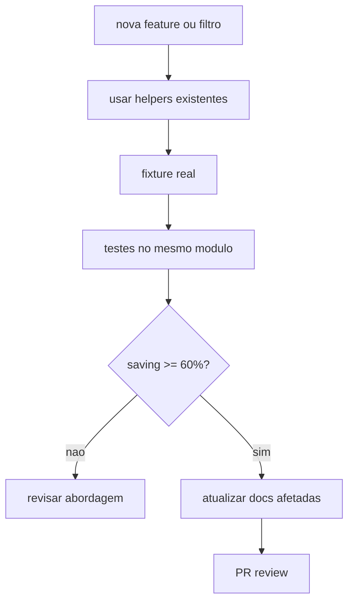
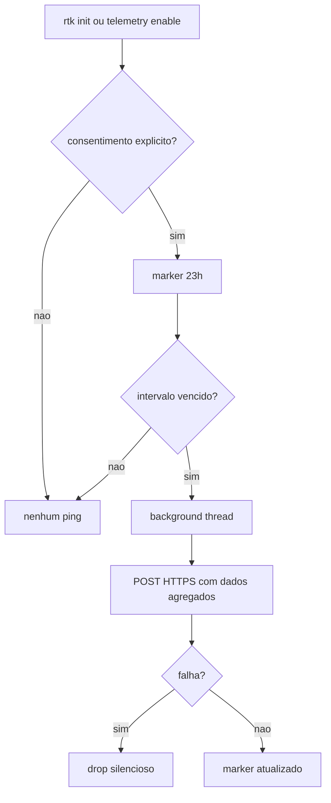

# Fluxograma — Modulo `docs`

## Jornada Do Usuario

```mermaid
flowchart TD
    A[Installation] --> B[verificar rtk gain]
    B --> C[rtk init por agente]
    C --> D[Supported Agents]
    D --> E[Configuration]
    E --> F[usar comandos normais]
    F --> G[rtk gain]
    F --> H[rtk discover/session]
    G --> I[Troubleshooting se necessario]
    H --> I
```

## Fluxo Tecnico Documentado

```mermaid
flowchart TD
    A[Agente roda comando] --> B[hook/plugin/rules]
    B --> C[rtk rewrite]
    C --> D[Clap parsing]
    D --> E{comando conhecido?}
    E -- sim --> F[filtro Rust cmds]
    E -- nao --> G{TOML filter match?}
    G -- sim --> H[pipeline TOML]
    G -- nao --> I[passthrough]
    F --> J[tracking SQLite]
    H --> J
    I --> J
    J --> K[analytics gain/session/discover]
```

## Contratos De Qualidade

```mermaid
flowchart TD
    A[nova feature ou filtro] --> B[usar helpers existentes]
    B --> C[fixture real]
    C --> D[testes no mesmo modulo]
    D --> E{saving >= 60%?}
    E -- nao --> F[revisar abordagem]
    E -- sim --> G[atualizar docs afetadas]
    G --> H[PR review]
```

## Telemetria E Privacidade

```mermaid
flowchart TD
    A[rtk init ou telemetry enable] --> B{consentimento explicito?}
    B -- nao --> C[nenhum ping]
    B -- sim --> D[marker 23h]
    D --> E{intervalo vencido?}
    E -- nao --> C
    E -- sim --> F[background thread]
    F --> G[POST HTTPS com dados agregados]
    G --> H{falha?}
    H -- sim --> I[drop silencioso]
    H -- nao --> J[marker atualizado]
```
