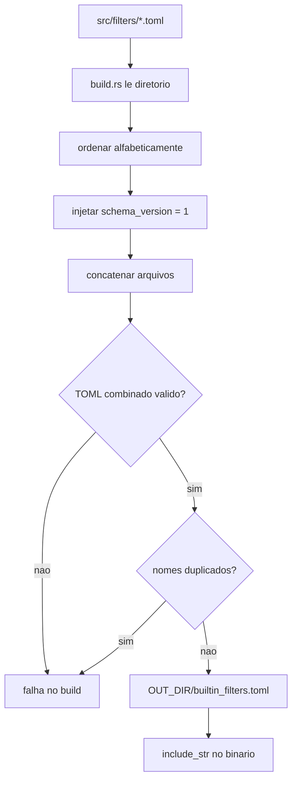
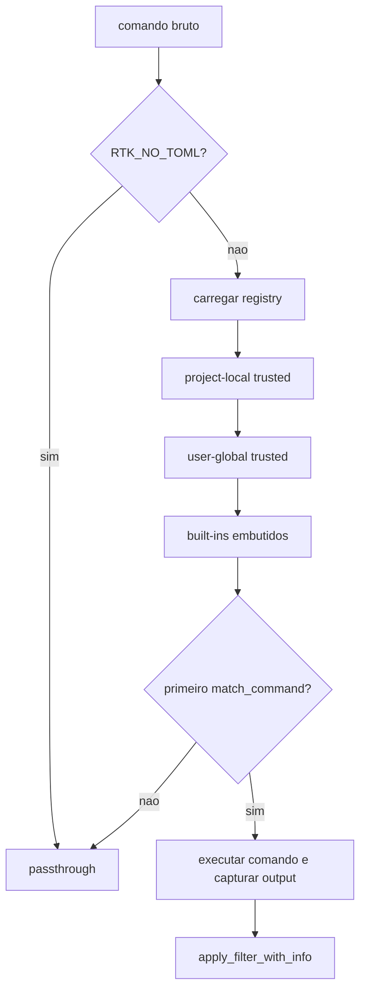
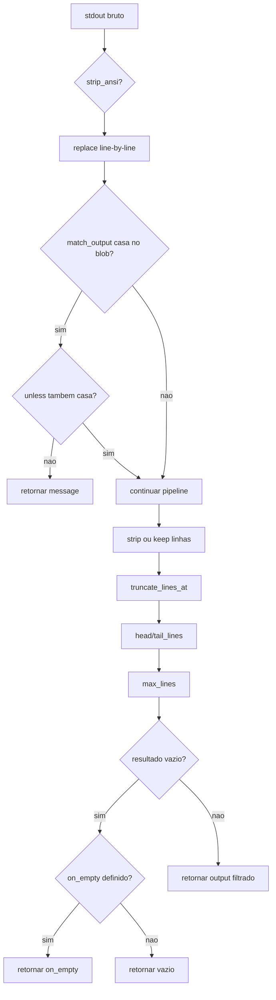
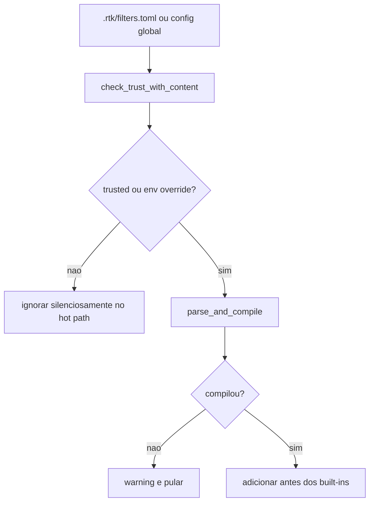

# Fluxograma — Modulo `filters`

## Build Dos Filtros Built-In

```mermaid
flowchart TD
    A[src/filters/*.toml] --> B[build.rs le diretorio]
    B --> C[ordenar alfabeticamente]
    C --> D[injetar schema_version = 1]
    D --> E[concatenar arquivos]
    E --> F{TOML combinado valido?}
    F -- nao --> G[falha no build]
    F -- sim --> H{nomes duplicados?}
    H -- sim --> G
    H -- nao --> I[OUT_DIR/builtin_filters.toml]
    I --> J[include_str no binario]
```

## Lookup Em Runtime

```mermaid
flowchart TD
    A[comando bruto] --> B{RTK_NO_TOML?}
    B -- sim --> Z[passthrough]
    B -- nao --> C[carregar registry]
    C --> D[project-local trusted]
    D --> E[user-global trusted]
    E --> F[built-ins embutidos]
    F --> G{primeiro match_command?}
    G -- nao --> Z
    G -- sim --> H[executar comando e capturar output]
    H --> I[apply_filter_with_info]
```

## Pipeline De Aplicacao

```mermaid
flowchart TD
    A[stdout bruto] --> B{strip_ansi?}
    B --> C[replace line-by-line]
    C --> D{match_output casa no blob?}
    D -- sim --> E{unless tambem casa?}
    E -- nao --> F[retornar message]
    E -- sim --> G[continuar pipeline]
    D -- nao --> G
    G --> H[strip ou keep linhas]
    H --> I[truncate_lines_at]
    I --> J[head/tail_lines]
    J --> K[max_lines]
    K --> L{resultado vazio?}
    L -- sim --> M{on_empty definido?}
    M -- sim --> N[retornar on_empty]
    M -- nao --> O[retornar vazio]
    L -- nao --> P[retornar output filtrado]
```

## Trust De Filtros Customizados

```mermaid
flowchart TD
    A[.rtk/filters.toml ou config global] --> B[check_trust_with_content]
    B --> C{trusted ou env override?}
    C -- nao --> D[ignorar silenciosamente no hot path]
    C -- sim --> E[parse_and_compile]
    E --> F{compilou?}
    F -- nao --> G[warning e pular]
    F -- sim --> H[adicionar antes dos built-ins]
```
