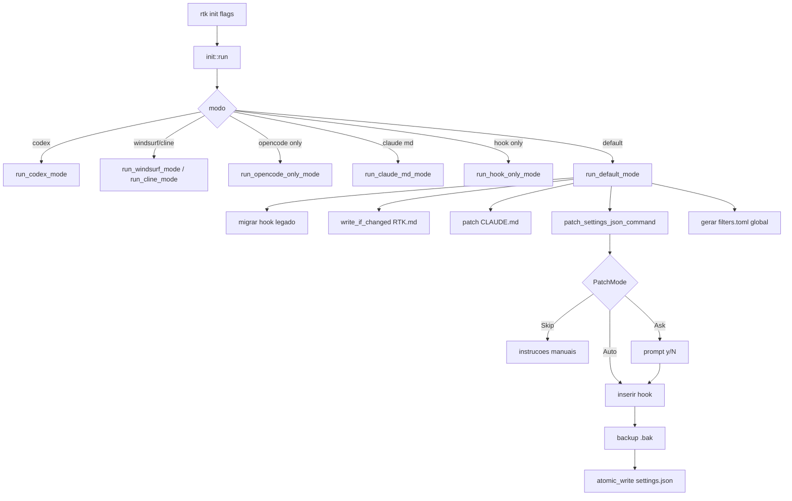
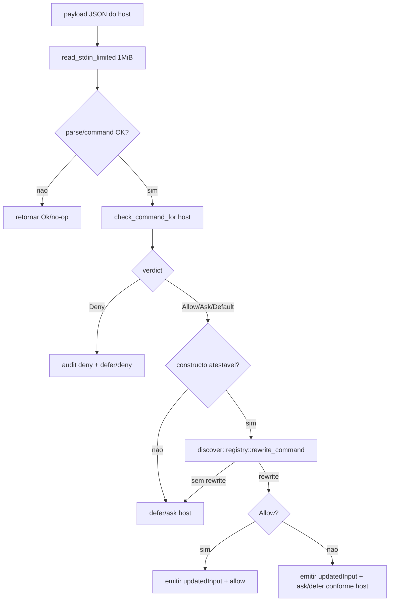
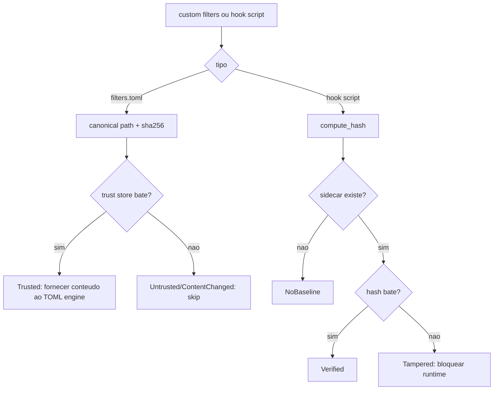

# Fluxograma — Modulo `hooks`

## Instalacao (`rtk init`)

```mermaid
flowchart TD
    A[rtk init flags] --> B[init::run]
    B --> C{modo}
    C -- codex --> D[run_codex_mode]
    C -- windsurf/cline --> E[run_windsurf_mode / run_cline_mode]
    C -- opencode only --> F[run_opencode_only_mode]
    C -- claude md --> G[run_claude_md_mode]
    C -- hook only --> H[run_hook_only_mode]
    C -- default --> I[run_default_mode]
    I --> J[migrar hook legado]
    I --> K[write_if_changed RTK.md]
    I --> L[patch CLAUDE.md]
    I --> M[patch_settings_json_command]
    M --> N{PatchMode}
    N -- Skip --> O[instrucoes manuais]
    N -- Ask --> P[prompt y/N]
    N -- Auto --> Q[inserir hook]
    P --> Q
    Q --> R[backup .bak]
    R --> S[atomic_write settings.json]
    I --> T[gerar filters.toml global]
```

## Decisao de rewrite em hook nativo

```mermaid
flowchart TD
    A[payload JSON do host] --> B[read_stdin_limited 1MiB]
    B --> C{parse/command OK?}
    C -- nao --> D[retornar Ok/no-op]
    C -- sim --> E[check_command_for host]
    E --> F{verdict}
    F -- Deny --> G[audit deny + defer/deny]
    F -- Allow/Ask/Default --> H{constructo atestavel?}
    H -- nao --> I[defer/ask host]
    H -- sim --> J[discover::registry::rewrite_command]
    J -- sem rewrite --> I
    J -- rewrite --> K{Allow?}
    K -- sim --> L[emitir updatedInput + allow]
    K -- nao --> M[emitir updatedInput + ask/defer conforme host]
```

## Trust e integridade

```mermaid
flowchart TD
    A[custom filters ou hook script] --> B{tipo}
    B -- filters.toml --> C[canonical path + sha256]
    C --> D{trust store bate?}
    D -- sim --> E[Trusted: fornecer conteudo ao TOML engine]
    D -- nao --> F[Untrusted/ContentChanged: skip]
    B -- hook script --> G[compute_hash]
    G --> H{sidecar existe?}
    H -- nao --> I[NoBaseline]
    H -- sim --> J{hash bate?}
    J -- sim --> K[Verified]
    J -- nao --> L[Tampered: bloquear runtime]
```

