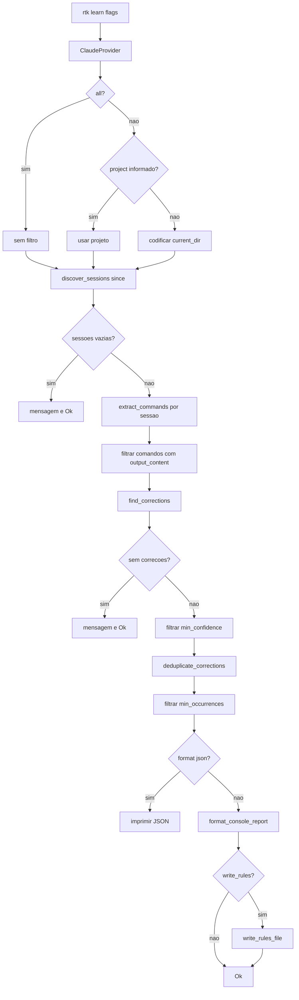
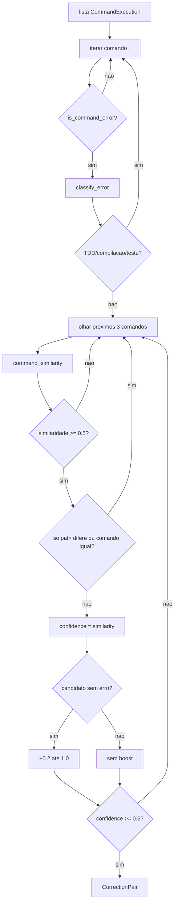
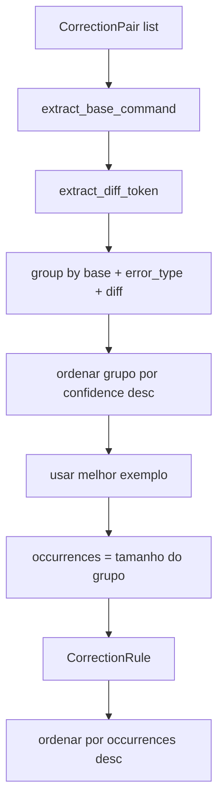

# Fluxograma — Modulo `learn`

## `rtk learn`

```mermaid
flowchart TD
    A[rtk learn flags] --> B[ClaudeProvider]
    B --> C{all?}
    C -- sim --> D[sem filtro]
    C -- nao --> E{project informado?}
    E -- sim --> F[usar projeto]
    E -- nao --> G[codificar current_dir]
    D --> H[discover_sessions since]
    F --> H
    G --> H
    H --> I{sessoes vazias?}
    I -- sim --> J[mensagem e Ok]
    I -- nao --> K[extract_commands por sessao]
    K --> L[filtrar comandos com output_content]
    L --> M[find_corrections]
    M --> N{sem correcoes?}
    N -- sim --> O[mensagem e Ok]
    N -- nao --> P[filtrar min_confidence]
    P --> Q[deduplicate_corrections]
    Q --> R[filtrar min_occurrences]
    R --> S{format json?}
    S -- sim --> T[imprimir JSON]
    S -- nao --> U[format_console_report]
    U --> V{write_rules?}
    V -- sim --> W[write_rules_file]
    V -- nao --> X[Ok]
    W --> X
```

## Deteccao De Correcao

```mermaid
flowchart TD
    A[lista CommandExecution] --> B[iterar comando i]
    B --> C{is_command_error?}
    C -- nao --> B
    C -- sim --> D[classify_error]
    D --> E{TDD/compilacao/teste?}
    E -- sim --> B
    E -- nao --> F[olhar proximos 3 comandos]
    F --> G[command_similarity]
    G --> H{similaridade >= 0.5?}
    H -- nao --> F
    H -- sim --> I{so path difere ou comando igual?}
    I -- sim --> F
    I -- nao --> J[confidence = similarity]
    J --> K{candidato sem erro?}
    K -- sim --> L[+0.2 ate 1.0]
    K -- nao --> M[sem boost]
    L --> N{confidence >= 0.6?}
    M --> N
    N -- sim --> O[CorrectionPair]
    N -- nao --> F
```

## Deduplicacao E Regras

```mermaid
flowchart TD
    A[CorrectionPair list] --> B[extract_base_command]
    B --> C[extract_diff_token]
    C --> D[group by base + error_type + diff]
    D --> E[ordenar grupo por confidence desc]
    E --> F[usar melhor exemplo]
    F --> G[occurrences = tamanho do grupo]
    G --> H[CorrectionRule]
    H --> I[ordenar por occurrences desc]
```
