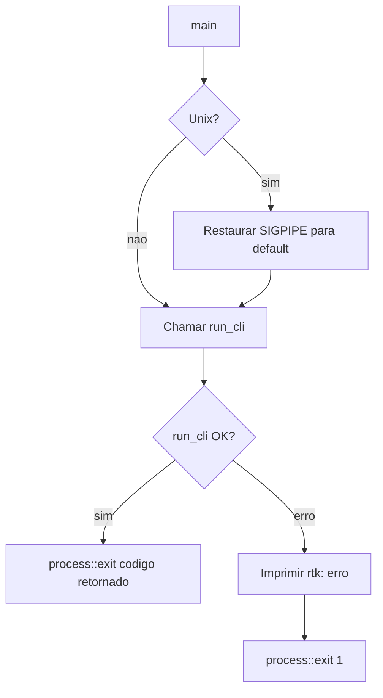
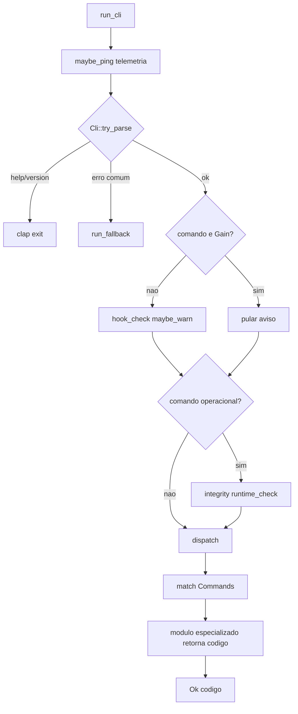
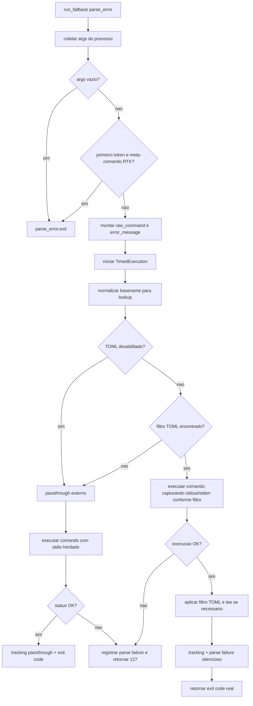
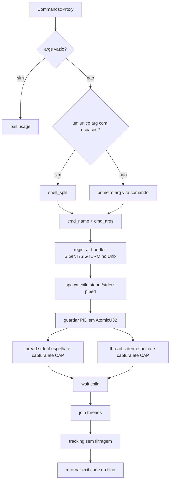

# Fluxograma — Modulo `main`

## Execucao principal

```mermaid
flowchart TD
    A[main] --> B{Unix?}
    B -- sim --> C[Restaurar SIGPIPE para default]
    B -- nao --> D[Chamar run_cli]
    C --> D[Chamar run_cli]
    D --> E{run_cli OK?}
    E -- sim --> F[process::exit codigo retornado]
    E -- erro --> G[Imprimir rtk: erro]
    G --> H[process::exit 1]
```

## `run_cli`

```mermaid
flowchart TD
    A[run_cli] --> B[maybe_ping telemetria]
    B --> C{Cli::try_parse}
    C -- help/version --> D[clap exit]
    C -- erro comum --> E[run_fallback]
    C -- ok --> F{comando e Gain?}
    F -- nao --> G[hook_check maybe_warn]
    F -- sim --> H[pular aviso]
    G --> I{comando operacional?}
    H --> I
    I -- sim --> J[integrity runtime_check]
    I -- nao --> K[dispatch]
    J --> K
    K --> L[match Commands]
    L --> M[modulo especializado retorna codigo]
    M --> N[Ok codigo]
```

## `run_fallback`

```mermaid
flowchart TD
    A[run_fallback parse_error] --> B[coletar args do processo]
    B --> C{args vazio?}
    C -- sim --> D[parse_error.exit]
    C -- nao --> E{primeiro token e meta-comando RTK?}
    E -- sim --> D
    E -- nao --> F[montar raw_command e error_message]
    F --> G[iniciar TimedExecution]
    G --> H[normalizar basename para lookup]
    H --> I{TOML desabilitado?}
    I -- sim --> P[passthrough externo]
    I -- nao --> J{filtro TOML encontrado?}
    J -- nao --> P
    J -- sim --> K[executar comando capturando stdout/stderr conforme filtro]
    K --> L{execucao OK?}
    L -- nao --> M[registrar parse failure e retornar 127]
    L -- sim --> N[aplicar filtro TOML e tee se necessario]
    N --> O[tracking + parse failure silencioso]
    O --> Q[retornar exit code real]
    P --> R[executar comando com stdio herdado]
    R --> S{status OK?}
    S -- sim --> T[tracking passthrough + exit code]
    S -- nao --> M
```

## `proxy`

```mermaid
flowchart TD
    A[Commands::Proxy] --> B{args vazio?}
    B -- sim --> C[bail usage]
    B -- nao --> D{um unico arg com espacos?}
    D -- sim --> E[shell_split]
    D -- nao --> F[primeiro arg vira comando]
    E --> G[cmd_name + cmd_args]
    F --> G
    G --> H[registrar handler SIGINT/SIGTERM no Unix]
    H --> I[spawn child stdout/stderr piped]
    I --> J[guardar PID em AtomicU32]
    J --> K[thread stdout espelha e captura ate CAP]
    J --> L[thread stderr espelha e captura ate CAP]
    K --> M[wait child]
    L --> M
    M --> N[join threads]
    N --> O[tracking sem filtragem]
    O --> P[retornar exit code do filho]
```

