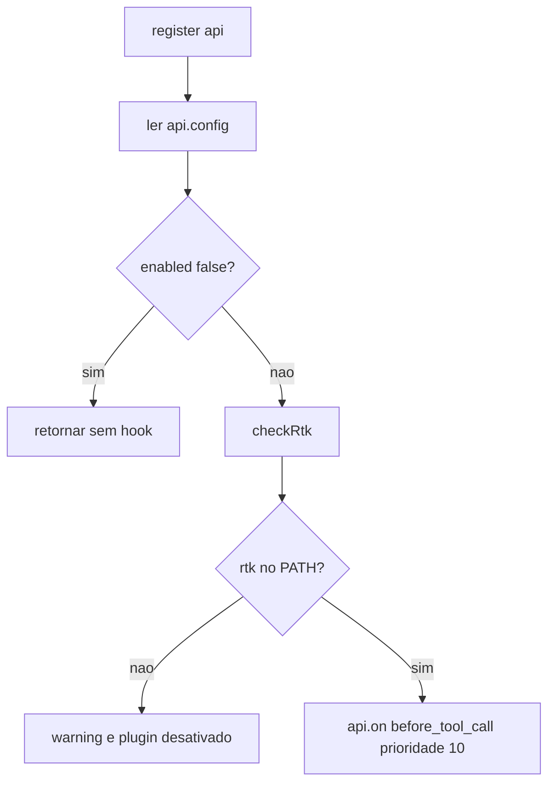
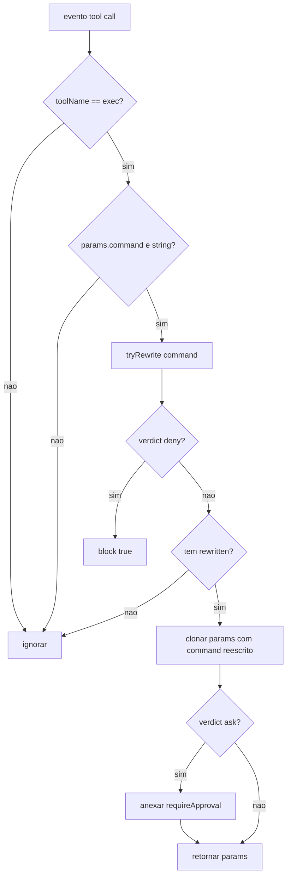
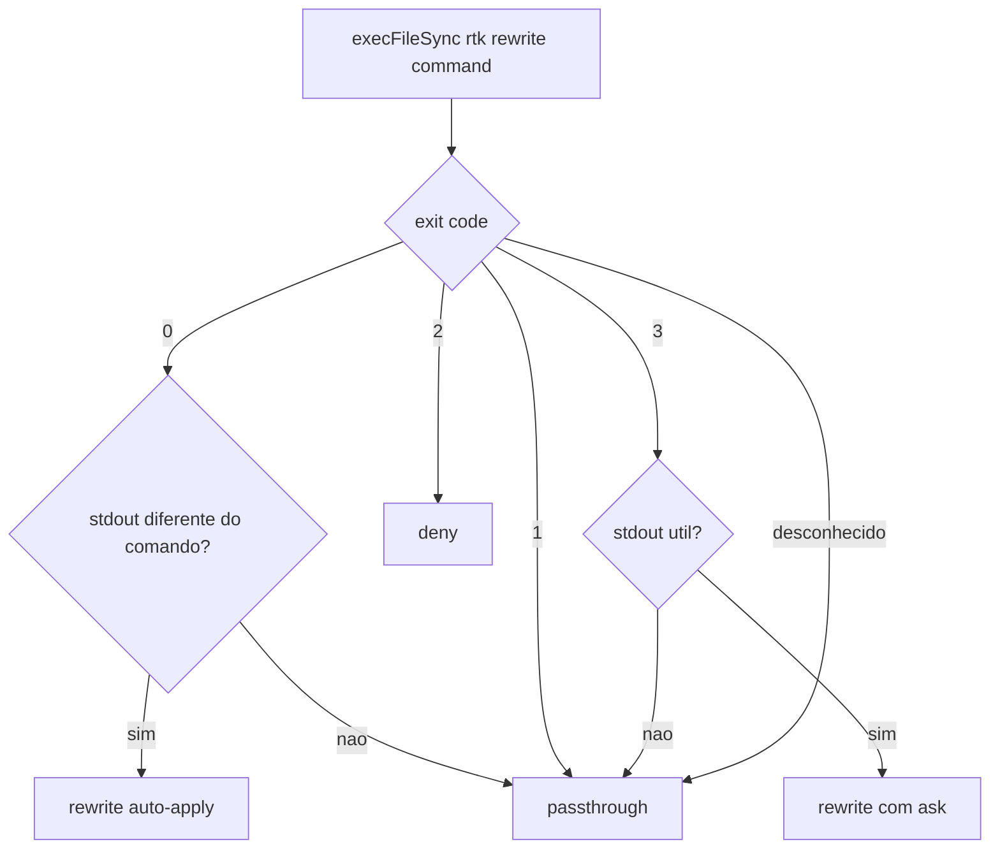

# Fluxograma — Modulo `openclaw`

## Registro Do Plugin

```mermaid
flowchart TD
    A[register api] --> B[ler api.config]
    B --> C{enabled false?}
    C -- sim --> D[retornar sem hook]
    C -- nao --> E[checkRtk]
    E --> F{rtk no PATH?}
    F -- nao --> G[warning e plugin desativado]
    F -- sim --> H[api.on before_tool_call prioridade 10]
```

## Handler before_tool_call

```mermaid
flowchart TD
    A[evento tool call] --> B{toolName == exec?}
    B -- nao --> Z[ignorar]
    B -- sim --> C{params.command e string?}
    C -- nao --> Z
    C -- sim --> D[tryRewrite command]
    D --> E{verdict deny?}
    E -- sim --> F[block true]
    E -- nao --> G{tem rewritten?}
    G -- nao --> Z
    G -- sim --> H[clonar params com command reescrito]
    H --> I{verdict ask?}
    I -- sim --> J[anexar requireApproval]
    I -- nao --> K[retornar params]
    J --> K
```

## Protocolo rtk rewrite

```mermaid
flowchart TD
    A[execFileSync rtk rewrite command] --> B{exit code}
    B -- 0 --> C{stdout diferente do comando?}
    C -- sim --> D[rewrite auto-apply]
    C -- nao --> E[passthrough]
    B -- 1 --> E
    B -- 2 --> F[deny]
    B -- 3 --> G{stdout util?}
    G -- sim --> H[rewrite com ask]
    G -- nao --> E
    B -- desconhecido --> E
```
