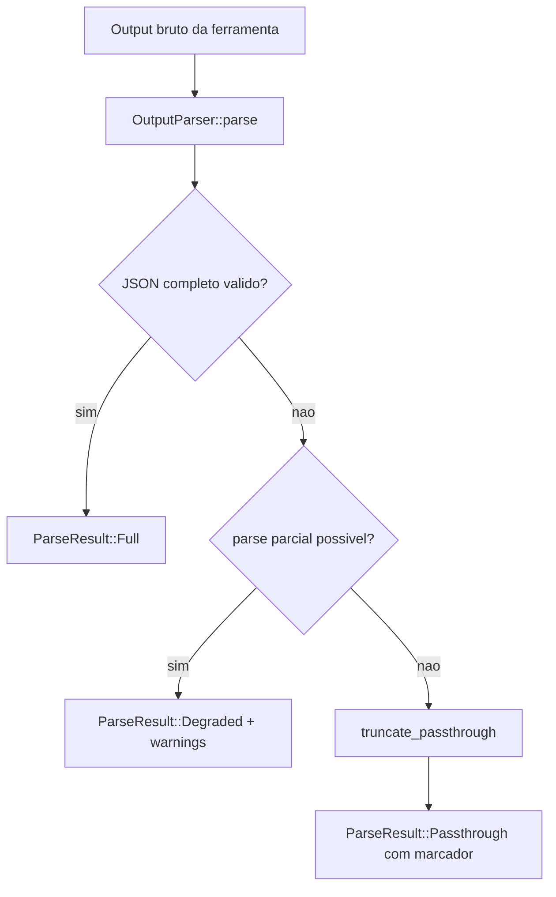
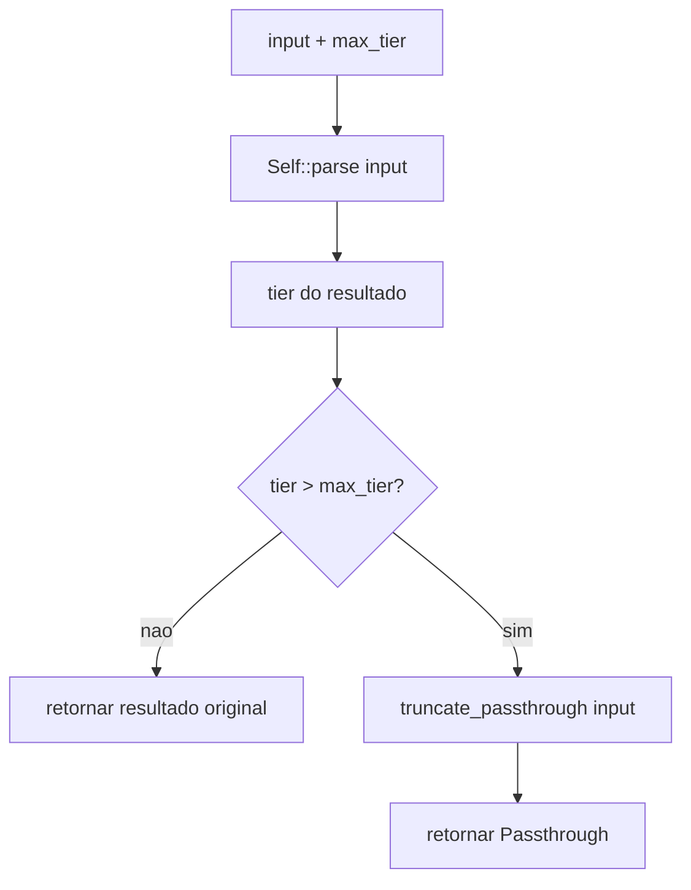
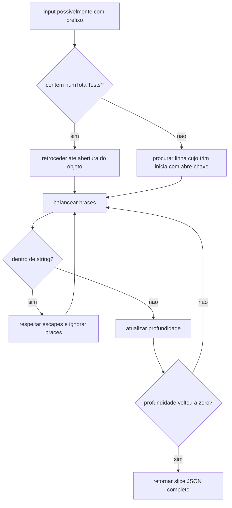
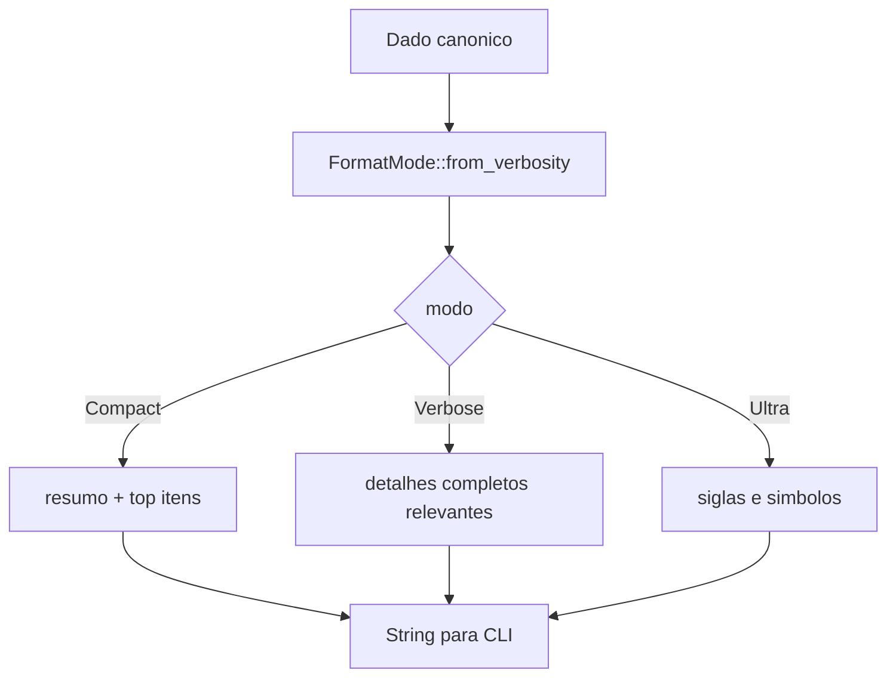

# Fluxograma — Modulo `parser`

## Parsing Com Degradacao

```mermaid
flowchart TD
    A[Output bruto da ferramenta] --> B[OutputParser::parse]
    B --> C{JSON completo valido?}
    C -- sim --> D[ParseResult::Full]
    C -- nao --> E{parse parcial possivel?}
    E -- sim --> F[ParseResult::Degraded + warnings]
    E -- nao --> G[truncate_passthrough]
    G --> H[ParseResult::Passthrough com marcador]
```

## parse_with_tier

```mermaid
flowchart TD
    A[input + max_tier] --> B[Self::parse input]
    B --> C[tier do resultado]
    C --> D{tier > max_tier?}
    D -- nao --> E[retornar resultado original]
    D -- sim --> F[truncate_passthrough input]
    F --> G[retornar Passthrough]
```

## Extracao De JSON Embutido

```mermaid
flowchart TD
    A[input possivelmente com prefixo] --> B{contem numTotalTests?}
    B -- sim --> C[retroceder ate abertura do objeto]
    B -- nao --> D[procurar linha cujo trim inicia com abre-chave]
    C --> E[balancear braces]
    D --> E
    E --> F{dentro de string?}
    F -- sim --> G[respeitar escapes e ignorar braces]
    F -- nao --> H[atualizar profundidade]
    G --> E
    H --> I{profundidade voltou a zero?}
    I -- sim --> J[retornar slice JSON completo]
    I -- nao --> E
```

## Formatacao Token-Efficient

```mermaid
flowchart TD
    A[Dado canonico] --> B[FormatMode::from_verbosity]
    B --> C{modo}
    C -- Compact --> D[resumo + top itens]
    C -- Verbose --> E[detalhes completos relevantes]
    C -- Ultra --> F[siglas e simbolos]
    D --> G[String para CLI]
    E --> G
    F --> G
```
