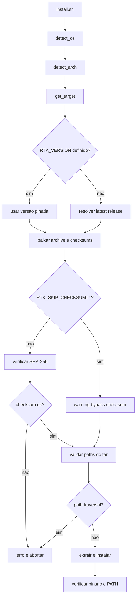
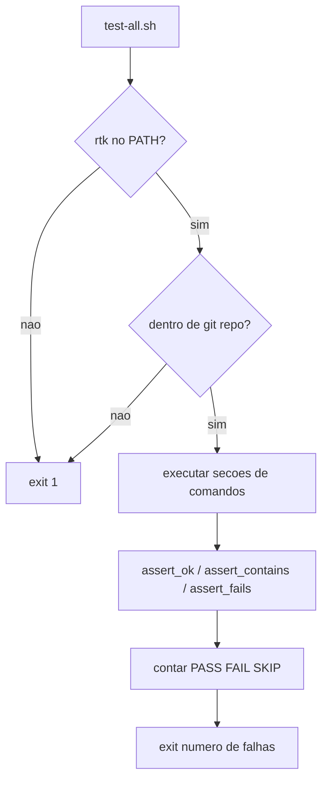
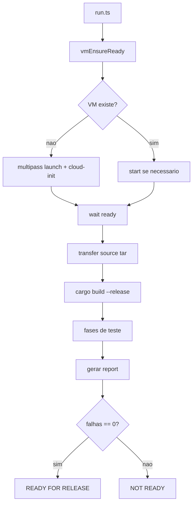

# Fluxograma — Modulo `scripts`

## Instalador Remoto



## Smoke Test Local



## Benchmark Em VM



## Guard De Testes Inline

```mermaid
flowchart TD
    A[check-test-presence.sh] --> B[git diff base...HEAD]
    B --> C[filtrar src/cmds/*_cmd.rs]
    C --> D{ha arquivos?}
    D -- nao --> E[OK]
    D -- sim --> F[grep cfg(test)]
    F --> G{todos tem testes?}
    G -- sim --> E
    G -- nao --> H[FAIL exit 1]
```
