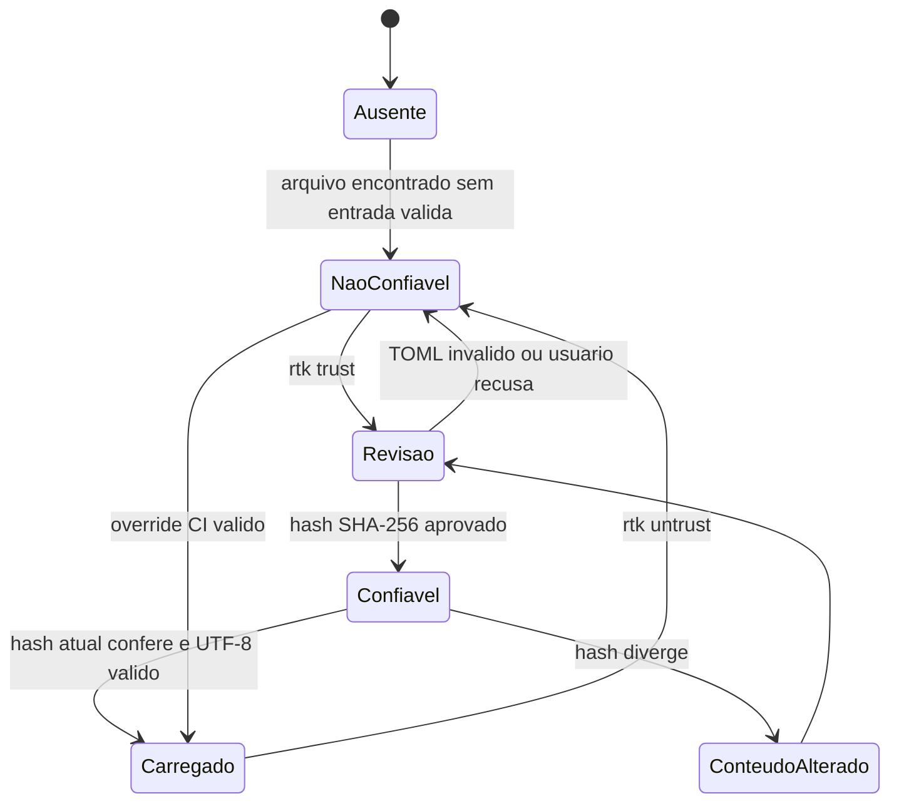
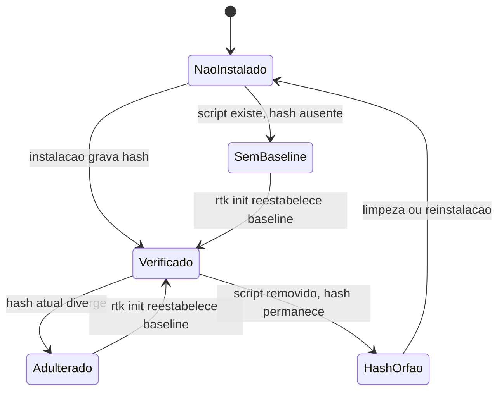
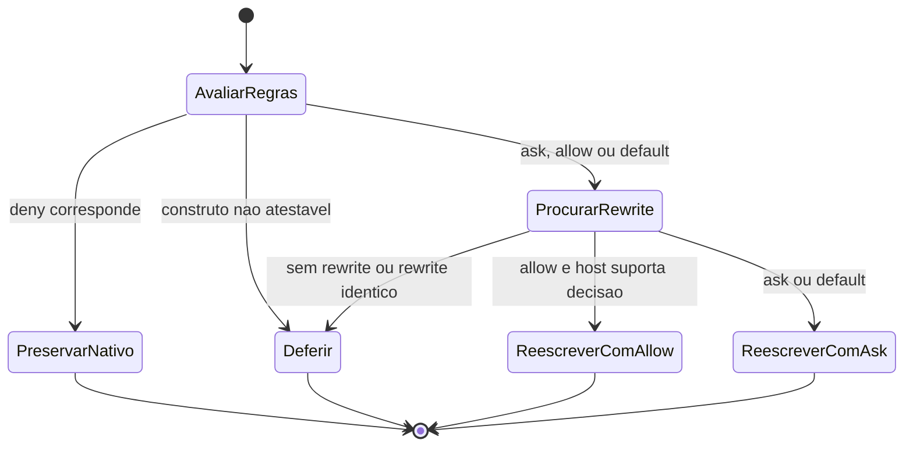
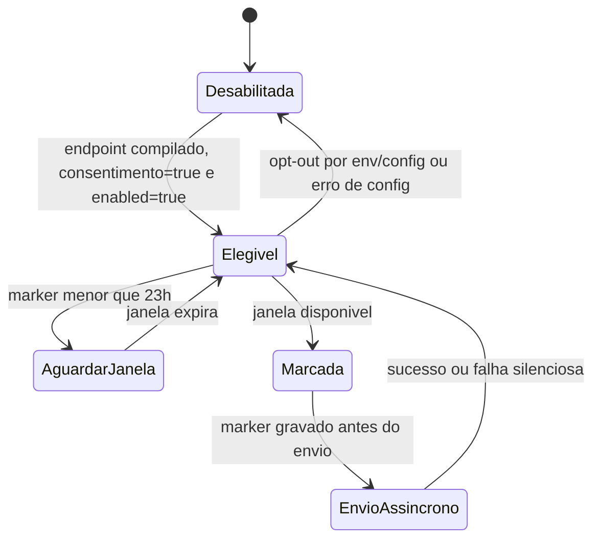

# Maquinas de Estado - RTK

Projeto: `rtk`  
Fase: Interpretacao (Detetive)

## Escala de confianca

- 🟢 **CONFIRMADO** - transicao codificada.
- 🟡 **INFERIDO** - composicao de fluxos confirmados.
- 🔴 **LACUNA** - sem validacao em execucao.

## Confianca de filtros customizados

🟢 A transicao `Confiavel -> ConteudoAlterado` impede carga do conteudo alterado. O override so vale para CI detectado e continua exigindo leitura bem-sucedida.

## Integridade do hook legado

🟢 Em comandos operacionais, `Adulterado` encerra com codigo 1; `SemBaseline` e `HashOrfao` permitem continuidade com comportamento de compatibilidade. Hooks binarios nativos nao possuem script a verificar.

## Decisao de permissao e rewrite

🟢 `Deny` tem precedencia maxima. 🟢 Para cadeias compostas, todos os segmentos devem corresponder a allow para chegar a `ReescreverComAllow`. 🟢 Para Droid, allow nao e emitido: um deny/block faz `PreservarNativo`; demais rewrites nao carregam decisao de permissao.

## Elegibilidade e envio de telemetria

🟢 O fluxo e fire-and-forget; falha no envio nao altera o fluxo principal do CLI. 🔴 A entrega HTTP e o endpoint nao foram exercitados nesta analise.
